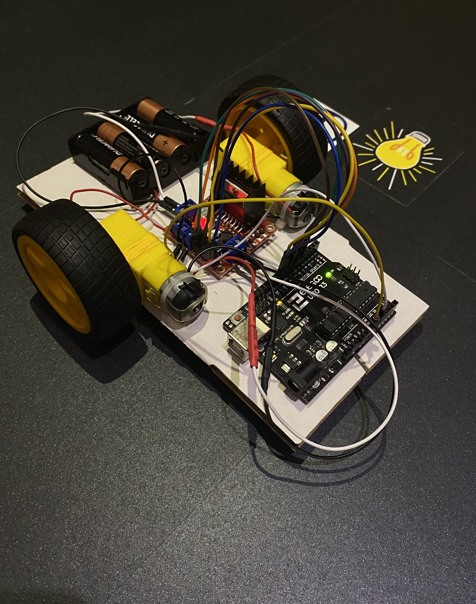
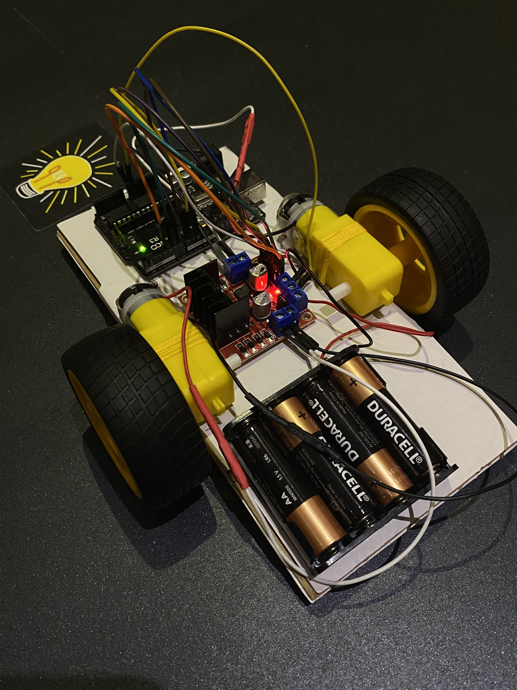
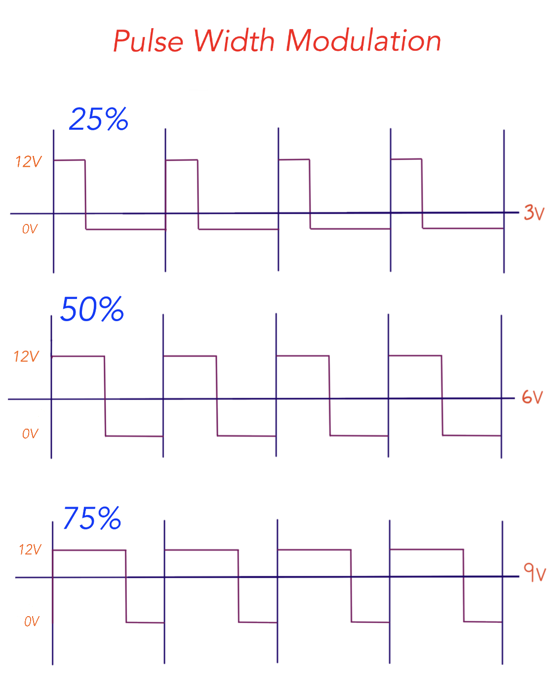

# Car V1.0 :red_car: 

## Description

This is the first version of my robot car. The car spins clockwise at max speed, stops for 2 seconds, spins counterclockwise at max speed, stops for 2 seconds and repeats that cycle again but at half speed.

I built it using 2 <b>TT motors</b>, an <b>L298N motor driver</b> module for <b>pulse-width-modulation</b>, and an <b>Arduino Uno</b>. 

## Visuals

[Car V1.0 In Action](https://www.youtube.com/shorts/o6lACSQ6hl8)

### - 

### Pulse Width Modulation

